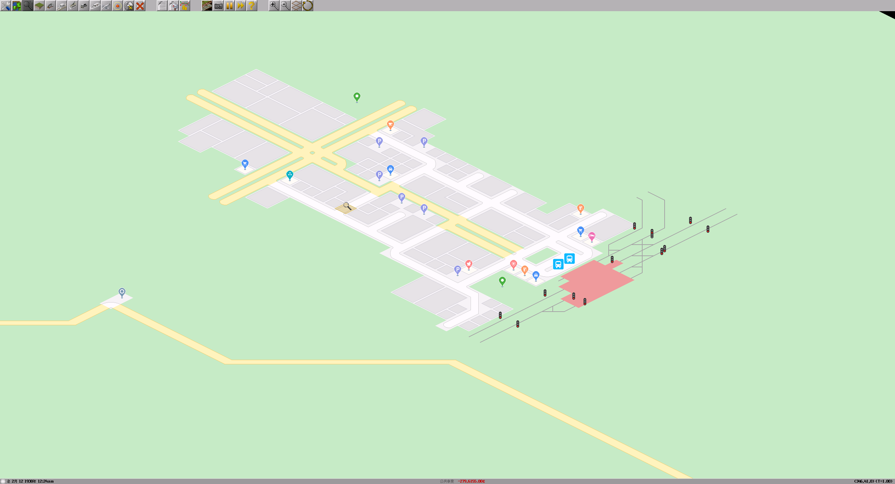

# Pak64.map



G〇ogleMapみたいなパックセットの試作品です。
pak64のアドオンの導入が可能です。

# 導入
**※まだ試作段階のためファイル名などいろいろが変更になる場合があります。**

リリースページから `pak64.map.zip` をダウンロードし、他のパックセット同様にsimutransフォルダに設置してください。 
https://github.com/128na/pak64.map/releases

## ドキュメント
左側通行の設定や影の扱い方などのTIPSやその他ドキュメント類

- [TIPS](./docs/tips.md)
- [命名則](./docs/naming_rule.md)

## 実装状況

|完了|項目|進捗|
|---|---|---|
|✔️|[bridge](./src/dat/bridge)||
|　|[building](./src/dat/building)|市内：3x3まで、特殊：1x1のみ|
|✔️|[crossing](./src/dat/crossing)||
|　|[cursor](./src/dat/cursor)|一部64流用|
|✔️|[good](./src/dat/good)||
|　|[ground](./src/dat/ground)|一部64,nippon流用|
|✔️|[menu](./src/dat/menu)||
|✔️|[misc](./src/dat/misc)||
|✔️|[roadsign](./src/dat/roadsign)||
|　|[stop](./src/dat/stop)|港以外|
|　|[symbol](./src/dat/symbol)|64流用|
|✔|[tunnel](./src/dat/tunnel)||
|✔|[way](./src/dat/way)||

# 開発用
## Pak化
予めnode,npmが使用できるようにしてください。
また、makeobjにパスを通すか、このディレクトリに設置してください。

```
npm install
npm run build
```
`/pak64.map` ディレクトリにpakが生成されます。

### ファイル変更時自動pak化

```
npm run watch
```
dat,configディレクトリ内のファイル変更、追加、削除時に自動でpak化を実行します。

# 参考
64公式、pak.nipponをベースに作成しています（未実装部分はそのまま流用しています）

64公式
https://sourceforge.net/p/simutrans/code/HEAD/tree/

pak.nippon
https://github.com/wa-st/pak-nippon