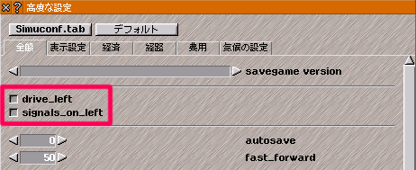

# Pak64.map


G〇ogleMapみたいなパックセットの試作品です。
pak64のアドオンの導入が可能です。

# 導入
**※まだ試作段階のためファイル名などいろいろが変更になる場合があります。**

リリースページから `pak64.map.zip` をダウンロードし、他のパックセット同様にsimutransフォルダに設置してください。 
https://github.com/128na/pak64.map/releases

## 左側通行使用時の注意
信号機の配置はデフォルトで**右側通行**の配置になっています。
左側通行にする場合は`@` キーを押して高度な設定を呼出し、 `drive_left`と`signals_on_left`を有効にして下さい。

※signals_on_leftを有効にした状態でsignals_on_left未対応の信号アドオンを導入すると位置がずれます




## 実装状況

|完了|項目|進捗|
|---|---|---|
|　|[building](./src/dat/building)|市内：3x3まで、特殊：1x1のみ|
|　|[cursor](./src/dat/cursor)|一部64流用|
|✔️|[good](./src/dat/good)||
|　|[ground](./src/dat/ground)|一部64,nippon流用|
|✔️|[menu](./src/dat/menu)||
|✔️|[misc](./src/dat/misc)||
|　|[roadsign](./src/dat/roadsign)|道路信号以外|
|　|[stop](./src/dat/stop)|港以外|
|　|[symbol](./src/dat/symbol)|64流用|
|✔|[way](./src/dat/way)||

# 開発用
## Pak化
予めnode,npmが使用できるようにしてください。
また、makeobjにパスを通すか、このディレクトリに設置してください。

```
npm install
npm run build
```
`/pak64.map` ディレクトリにpakが生成されます。

### ファイル変更時自動pak化

```
npm run watch
```
dat,configディレクトリ内のファイル変更、追加、削除時に自動でpak化を実行します。

# 参考
64公式、pak.nipponをベースに作成しています（未実装部分はそのまま流用しています）

64公式
https://sourceforge.net/p/simutrans/code/HEAD/tree/

pak.nippon
https://github.com/wa-st/pak-nippon