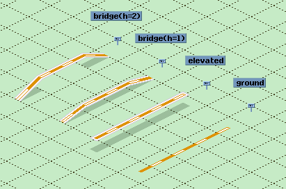
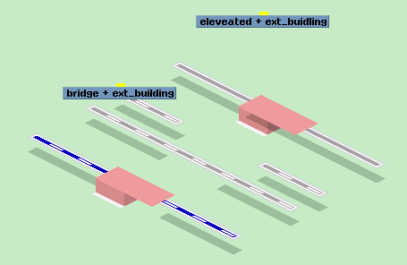
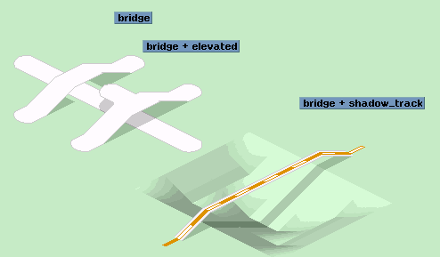

## 左側通行使用時の注意
- 信号機の配置はデフォルトで**右側通行**の配置になっています。
- 左側通行にする場合は`@` キーを押して高度な設定を呼出し、 `drive_left`と`signals_on_left`を有効にして下さい。

※signals_on_leftを有効にした状態でsignals_on_left未対応の信号アドオンを導入すると位置がずれます

## 橋・高架と影

- 高架属性の軌道には地面位置に半透過の影が設定されており、高架を引くだけで影が表示されます。
- 橋属性の軌道には**高さ２の橋梁部分以外**に影が設定されています。

### 高架駅
- 高架線下に駅ビルを設置すると影と干渉するため橋属性を使用すると良いです。

### 地形に合わせた影
- 高低差2で地上に影軌道を設置s出来ないような場所では高架線と組み合わせることで対応できます。
- 高低差2以上の端では影が表示されないため、特殊建築物ツールにある影だけの軌道を地上に設置することで地形に合わせた影をある程度表現できます。

